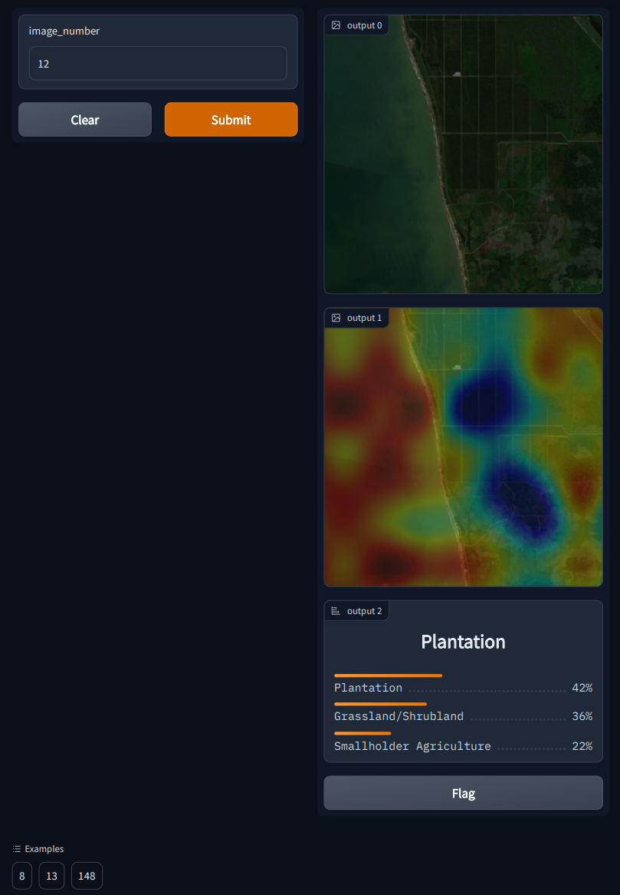

# nuwe-data-deforestation-2022
[https://nuwe.io/dev/challenges/data-science-se-european](https://nuwe.io/dev/challenges/data-science-se-european)

Team: Gradient Dissent

Victor Callejas Fuentes
victorcf999@gmail.com


## Environment and install
Tested on Windows 10 with Python 3.10.8
```
python -m venv env
.\env\Scripts\activate
python -m pip install requirements.txt
```

## Getting Started
- slides.pdf: 4 slides summing up my work and approach
- eda.ipynb: Basic exploration notebook of the data
- viz.ipynb: Interpretability of the model. Visualization of the attention on the image transformer backbone
- train.ipynb: notebook to train the model and generate the predictions
- src: library used on the notebooks for cleaness




